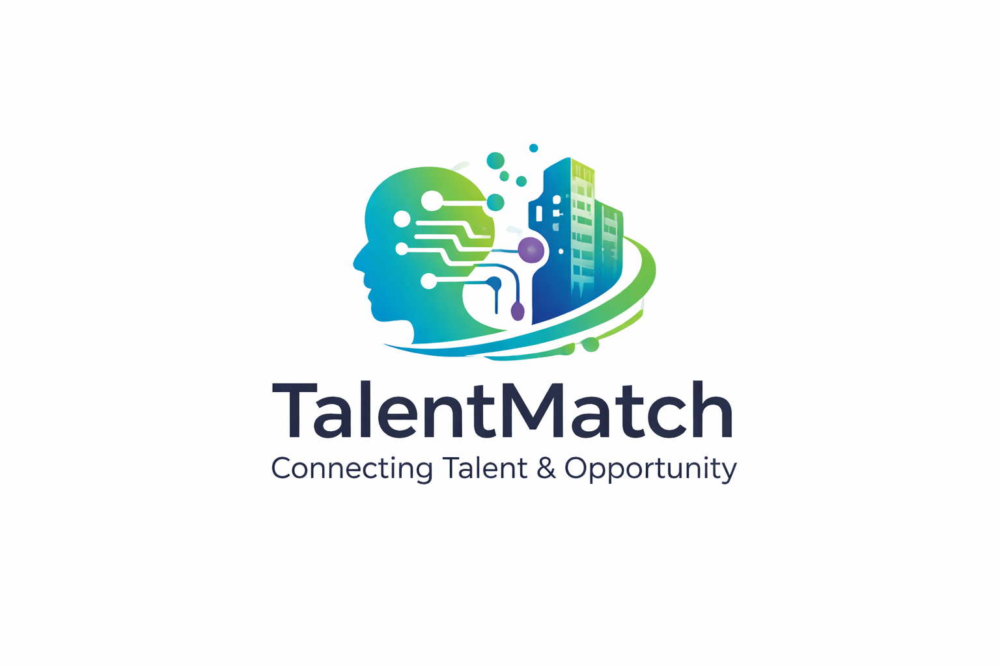

# TalentMatch - Plataforma de Búsqueda de Empleo con IA



**TalentMatch** es una plataforma moderna impulsada por inteligencia artificial que conecta empresas tecnológicas con profesionales especializados. Utiliza algoritmos de machine learning para proporcionar recomendaciones precisas y facilitar el matching entre talento y oportunidades.

## 🎯 Sobre el Proyecto

TalentMatch fue concebida como una solución innovadora al problema de encontrar talento especializado. Basada en el **Modelo Canvas de Negocios**, la plataforma ofrece:

- **Para Profesionales**: Descubre oportunidades personalizadas, destaca tu experiencia y conecta con empresas que buscan tu talento
- **Para Empresas**: Publica ofertas, accede a talento verificado y gestiona candidaturas con inteligencia artificial
- **Para Reclutadores**: Herramientas avanzadas de búsqueda, sistemas de recomendación y analítica de candidatos

## ✨ Características Principales

### 🤖 Inteligencia Artificial
- Recomendaciones automáticas basadas en ML
- Matching inteligente candidato-posición
- Análisis de compatibilidad de skills

### 💼 Gestión de Empleos
- Búsqueda avanzada por tecnología, ubicación, experiencia
- Dashboard para empresas
- Sistema de aplicaciones integrado

### 📊 Analytics & Insights
- Reportes de performance
- Estadísticas de búsqueda
- Tracking de candidatos

### 🔐 Seguridad & Privacidad
- Autenticación segura
- Encriptación de datos
- Cumplimiento GDPR

## 🚀 Tecnologías Utilizadas

### Frontend
- Jekyll (generador de sitios estáticos)
- Bootstrap 4
- CSS3 con variables y gradientes
- JavaScript moderno

### Backend & Infraestructura
- Node.js / Express (ofertas futuras)
- Python / Machine Learning (recomendaciones)
- AWS / Cloud Infrastructure

### Stack Recomendado
- **Frontend**: React, Next.js
- **Backend**: Go, Python, Node.js
- **Base de Datos**: PostgreSQL, MongoDB
- **Orquestación**: Kubernetes, Docker
- **IA/ML**: TensorFlow, PyTorch, Scikit-learn

## 📋 Modelos de Negocio (Canvas)

### Segmentos de Clientes
- B2B: Startups y empresas tecnológicas
- B2C: Profesionales en búsqueda de empleo
- B2HR: Equipos de recursos humanos

### Propuesta de Valor
- Recomendaciones inteligentes basadas en IA
- Búsqueda eficiente con filtros avanzados
- Visibilidad profesional y networking
- Dashboard intuitivo y fácil de usar

### Fuentes de Ingresos
- Plan Freemium (búsqueda básica)
- Premium: $9.99 USD/mes
- Publicaciones destacadas de ofertas
- Servicios corporativos personalizados

## 📊 Estadísticas

- **500+** ofertas de empleo disponibles
- **5,000+** profesionales registrados
- **200+** empresas partners
- **1,200+** matchs exitosos

## 🛠️ Instalación y Configuración

### Requisitos
- Ruby 2.7+
- Bundler
- Git

### Pasos

```bash
# 1. Clonar el repositorio
git clone https://github.com/SebastianHumberto/TalentMatch.git
cd TalentMatch

# 2. Instalar dependencias
bundle install

# 3. Servir localmente
bundle exec jekyll serve

# 4. Abrir en navegador
# Visita: http://localhost:4000
```

### Build para Producción
```bash
bundle exec jekyll build
# Outputs to _site/
```

## 📁 Estructura del Proyecto

```
TalentMatch/
├── _posts/              # Ofertas de empleo
├── _layouts/            # Plantillas HTML
├── _includes/           # Componentes reutilizables
├── _data/               # Configuración YAML (menú, etc)
├── assets/
│   ├── css/            # Estilos CSS y SCSS
│   ├── js/             # JavaScript
│   └── images/         # Logos e imágenes
├── _config.yml         # Configuración de Jekyll
└── index.html          # Homepage
```

## 🎨 Personalización

### Colores Principales
- **Verde Primario**: `#08a057`
- **Verde Claro**: `#12c972`
- **Azul Secundario**: `#3d61fd`
- **Blanco/Gris**: `#f8f9fa`

### Tipografía
- **Headings**: PT Serif
- **Body**: Inter, PT Sans

## 📄 Contenido y Posts

Las ofertas de empleo se crean como posts en `_posts/`:

```yaml
---
layout: post
title: "Título de la Oferta"
date: 2026-03-29
categories: [job]
company: "Nombre Empresa"
location: "Ciudad, País"
tags: [React, Frontend]
salary: "$2,000 - $3,500"
featured: true
---
```

## 🔗 Enlaces Importantes

- **Sitio Web**: https://sebastianhumberto.github.io/TalentMatch/
- **GitHub**: https://github.com/SebastianHumberto/TalentMatch
- **Modelo Canvas**: [Ver página de Canvas](/canvas/)
- **Contacto**: https://sebastianhumberto.github.io/TalentMatch/contact/

## 👥 Equipo

- **Sebastian** - Desarrollador Principal
- **Tatiana** - Colaboradora

Grupo 3 - ISISE

## 📝 Licencia

Este proyecto está bajo licencia MIT. Ver [LICENSE.txt](LICENSE.txt)

## 🤝 Contribuciones

Las contribuciones son bienvenidas. Por favor:

1. Fork el proyecto
2. Crea una rama para tu feature (`git checkout -b feature/AmazingFeature`)
3. Commit tus cambios (`git commit -m 'Add AmazingFeature'`)
4. Push a la rama (`git push origin feature/AmazingFeature`)
5. Abre un Pull Request

## 📞 Soporte

Para reportar bugs o sugerencias, abre un [issue en GitHub](https://github.com/SebastianHumberto/TalentMatch/issues).

---

**Hecho con ❤️ en Perú | Conectando talento con oportunidades**